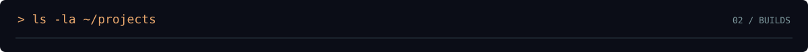
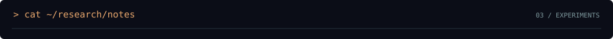
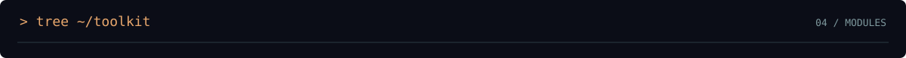

<!-- KUSHAL / THE ASCII ARCHIVE — GitHub profile README -->
<div align="center">
  <a href="https://kushalmanvekar.runs-on.dev/"></a>
  <sub><code>an archive of things built, broken, understood, and built again.</code></sub>
</div>

<br>


```text
$ cat identity.log

name       : Kushal M Anvekar
location   : Bengaluru, India
education  : Computer Science (AI/ML) · M.S. Ramaiah Polytechnic
focus      : AI systems / software engineering / open source
currently  : exploring intelligent agents, security, and applied research
availability: open to technology internships & collaboration
```

> I build software and put it to work. From model experiments to local-first tools, agent runtimes, and systems that connect the pieces.



```text
~/projects
│
├── sentinel/       local-first security intelligence for developers & agents
├── vakil-ai/       open-source legal research and drafting assistant
├── openconnect/    remote access to a personal development environment
├── mesh/           task coordination & reputation for collaborating AI agents
├── bedrock/        model-agnostic runtime for specialized AI systems
└── ai-video-editor/ experiments in ML-assisted media workflows
```

| Artifact | Field notes |
|:--|:--|
| **[Sentinel](https://github.com/Kushalongit-hub/Sentinel)** | Local-first developer security tooling · Rust, Ratatui, SQLite, MCP |
| **[Vakil AI](https://github.com/Kushalongit-hub/Vakil-ai)** | Legal research & drafting for Indian law · RAG, BNS/BNSS/BSA |
| **[OpenConnect](https://github.com/Kushalongit-hub?tab=repositories&q=OpenConnect)** | Remote desktop and terminal access · Node.js, Socket.IO, Go, Tailscale |
| **[MESH](https://github.com/Kushalongit-hub?tab=repositories&q=Mesh)** | Agent task markets and on-chain coordination · FastAPI, Solidity, Monad |
| **[Bedrock](https://github.com/Kushalongit-hub?tab=repositories&q=Bedrock)** | Portable agent kernel · Python, model routing, policies, memory |



```text
[RESEARCH LOG]                     status: in progress

01  SPATIAL INTELLIGENCE
    one image -> spatial relationships, depth, physical scene structure

02  MUTE / MASK-FREE UNIFIED TOKEN EDITING
    localized image edits -> preserve the surrounding world

03  AGENT INFRASTRUCTURE
    memory, execution policy, tool boundaries, interoperable runtimes
```



```text
~/toolkit
├── languages       Python · Rust · Java · JavaScript · SQL
├── intelligence    PyTorch · LLMs · NLP · RAG · LangGraph
├── application     FastAPI · Node.js · Socket.IO
├── infrastructure  Docker · Linux / WSL · GitHub Actions · GCP
└── experiments     NVIDIA NIM · MCP · n8n · Solidity
```


```text
$ cat contact.txt

status     : open to meaningful work
base       : Bengaluru, India
interests  : internships / research / open-source / interesting problems
```

<div align="center">
  <a href="https://kushalmanvekar.runs-on.dev/">portfolio</a> &nbsp;·&nbsp;
  <a href="https://github.com/Kushalongit-hub">github</a> &nbsp;·&nbsp;
  <a href="https://www.linkedin.com/in/kushal-m-anvekar/">linkedin</a> &nbsp;·&nbsp;
  <a href="mailto:kushalonmsrit@gmail.com">email</a>
</div>

<br>

<div align="center">
  <code>visitor@kushal:~$ echo "built with curiosity. shipped with intention."</code><br>
  <sub>the archive is never finished. ▌</sub>
</div>
