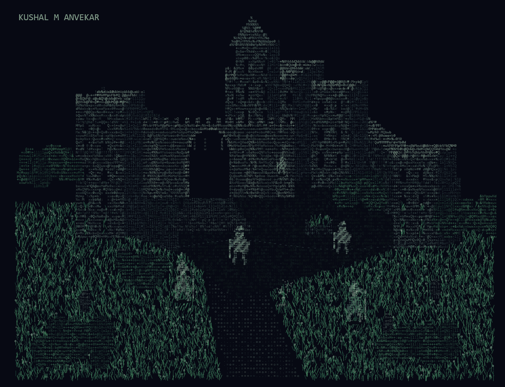

<!-- Animated ASCII castle artwork is hosted in ./assets. -->

<div align="center">
  
</div>

<br>

## The wanderer

> Building useful software at the intersection of AI, security, developer tools, and independent research. Computer Science diploma student at M. S. Ramaiah Polytechnic.

## The forge

| System | Artifact notes | Source |
|:---|:---|:---|
| `01 / sentinel` | Local-first security tooling for developers and agent workflows | [Explore ↗](https://github.com/Kushalongit-hub/Sentinel) |
| `02 / bedrock` | Portable, model-agnostic agent runtime with replaceable providers, memory and policy boundaries | [Explore ↗](https://github.com/Kushalongit-hub?tab=repositories&q=Bedrock) |
| `03 / vakil-ai` | Open-source legal intelligence and retrieval for Indian law | [Explore ↗](https://github.com/Kushalongit-hub/Vakil-ai) |
| `04 / mesh` | Decentralized coordination and task infrastructure for AI agents | [Explore ↗](https://github.com/Kushalongit-hub?tab=repositories&q=Mesh) |
| `05 / openconnect` | Tools for remote development access and connectivity | [Explore ↗](https://github.com/Kushalongit-hub?tab=repositories&q=OpenConnect) |

## The study

```text
$ cat research.notes
  spatial intelligence    -> understanding the physical structure of scenes
  image editing / MUTE    -> exploring localized edits and preservation
  agent infrastructure   -> memory, execution policy and tool boundaries
```

## The arsenal

```text
~/toolkit
├── language       Python / Java / JavaScript / SQL
├── intelligence   PyTorch / NLP / RAG / LLMs
├── backend        FastAPI / Node.js
└── infrastructure Docker / Linux / WSL / Git / MCP
```

## Summon signs

<div align="center">

[**PORTFOLIO**](https://kushalmanvekar.runs-on.dev/) &nbsp; · &nbsp; [**GITHUB**](https://github.com/Kushalongit-hub) &nbsp; · &nbsp; [**LINKEDIN**](https://www.linkedin.com/in/kushal-m-anvekar/)

</div>

<br>

> `building systems / breaking assumptions / learning in public`

<div align="center"><sub><code>keep the flame alive.</code></sub></div>
